# @atproto/oauth-provider-ui

The sign-in, sign-up, consent and account-management screens served by a PDS
during OAuth. React 19, TanStack Router, Tailwind 4, shadcn on Base UI, Lingui.

This fork carries a redesign of these screens. The reasoning behind it is in
[DesignPrinciples.md](./DesignPrinciples.md); the engineering constraints
are in [CLAUDE.md](./CLAUDE.md).

## Screens

Captured from the mock dev server at 390×844 (2×). The background
illustration and the Bluesky branding are the mock's placeholders; a
deployment supplies its own through the provider's customization options.

### Signing in

<table>
  <tr>
    <td align="center"><br><sub>Account picker</sub></td>
    <td align="center">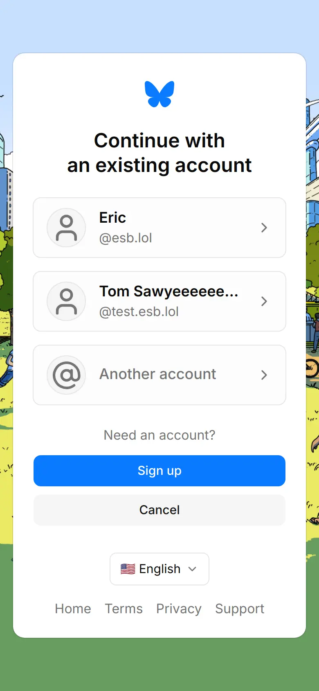<br><sub>Account picker, light</sub></td>
    <td align="center"><br><sub>Sign in</sub></td>
  </tr>
  <tr>
    <td align="center">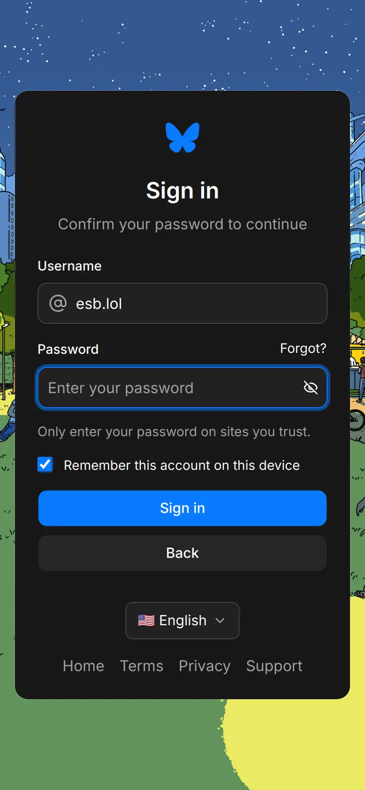<br><sub>Confirm password</sub></td>
    <td align="center">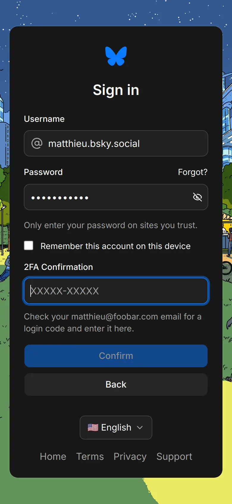<br><sub>2FA code</sub></td>
    <td align="center">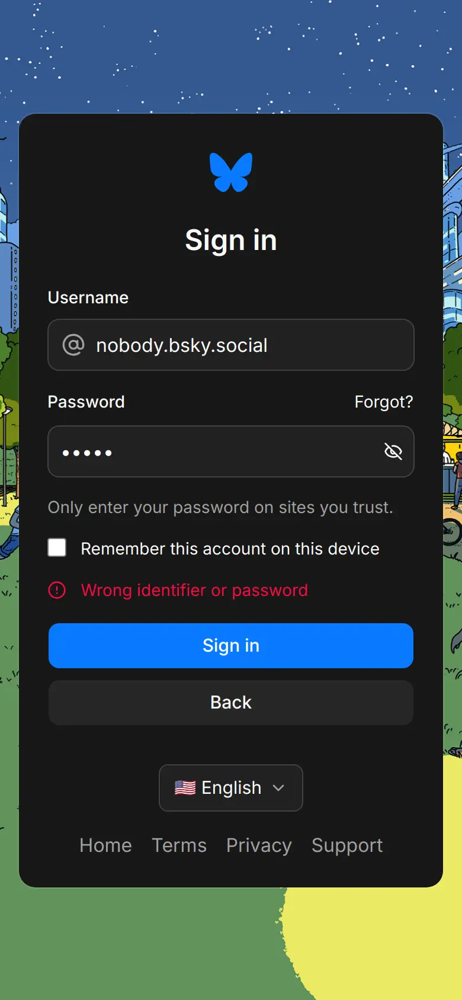<br><sub>Wrong credentials</sub></td>
  </tr>
</table>

### Password reset and sign-up

<table>
  <tr>
    <td align="center">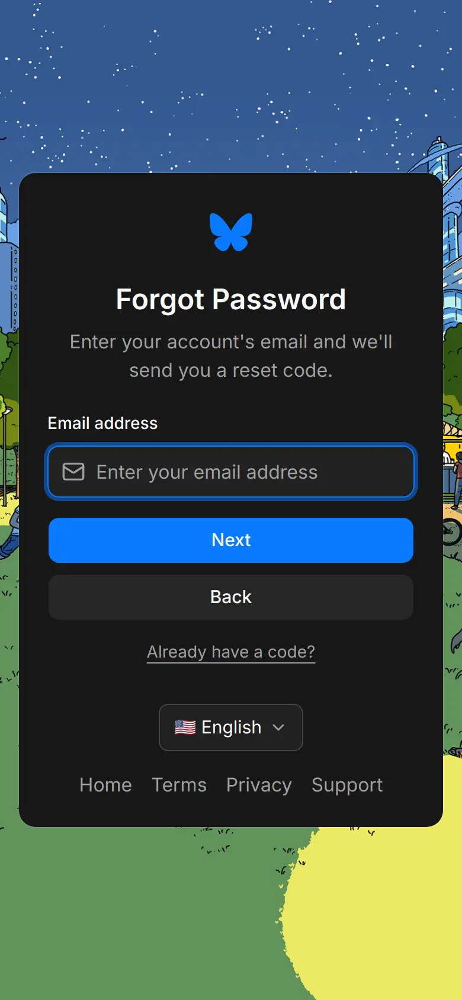<br><sub>Forgot password</sub></td>
    <td align="center">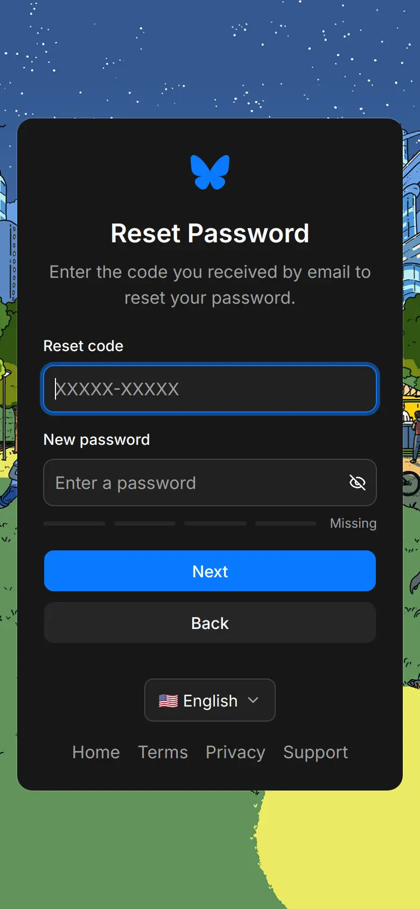<br><sub>Reset code + new password</sub></td>
    <td align="center"><br><sub>Sign up, step 1</sub></td>
  </tr>
  <tr>
    <td align="center">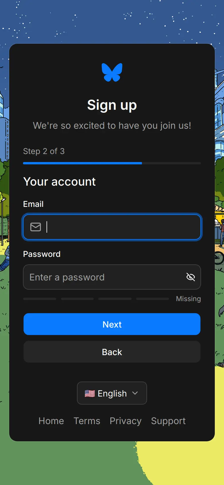<br><sub>Sign up, step 2</sub></td>
    <td align="center">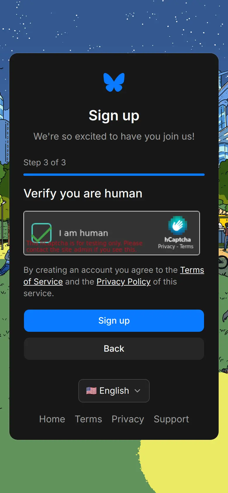<br><sub>Sign up, captcha</sub></td>
    <td align="center">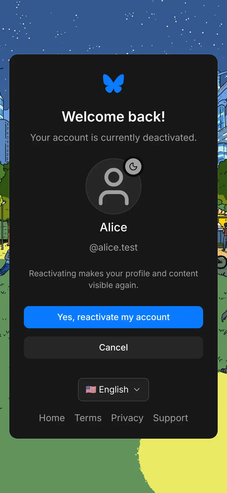<br><sub>Deactivated account</sub></td>
  </tr>
</table>

### Consent and redirect

<table>
  <tr>
    <td align="center"><br><sub>Consent</sub></td>
    <td align="center">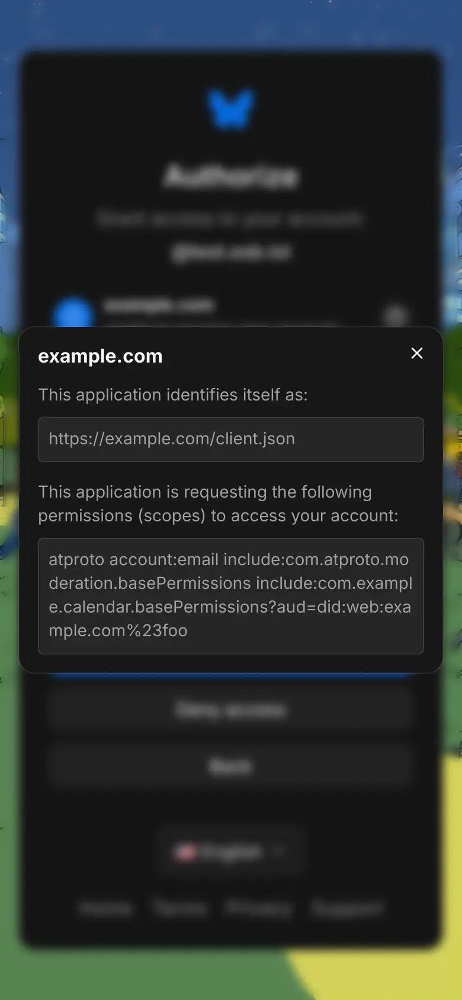<br><sub>Technical details</sub></td>
    <td align="center">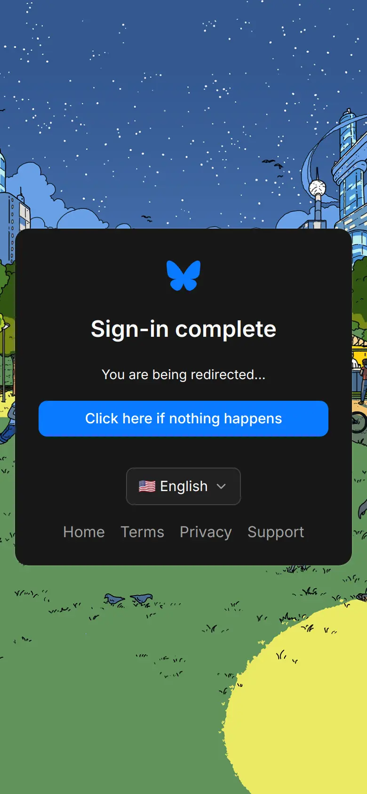<br><sub>Redirecting</sub></td>
  </tr>
</table>

### Errors

<table>
  <tr>
    <td align="center"><br><sub>Error page</sub></td>
    <td align="center">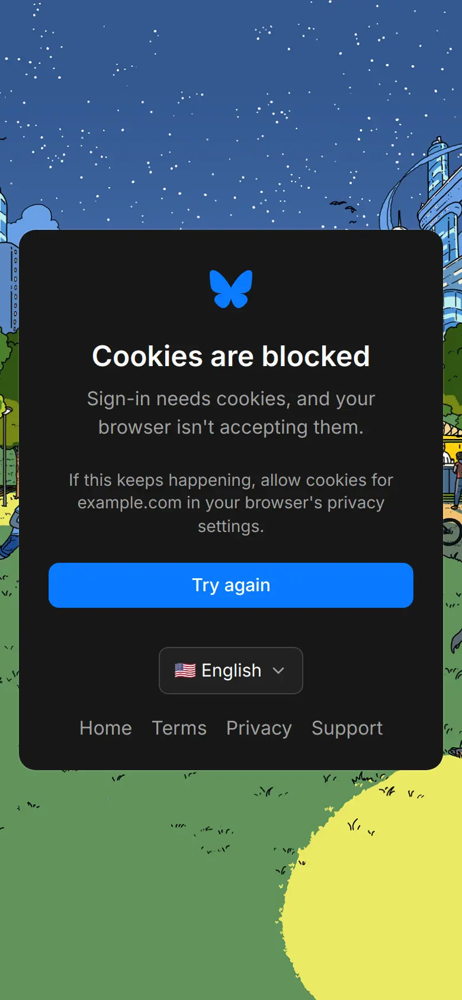<br><sub>Cookie error</sub></td>
  </tr>
</table>

### Account management

<table>
  <tr>
    <td align="center">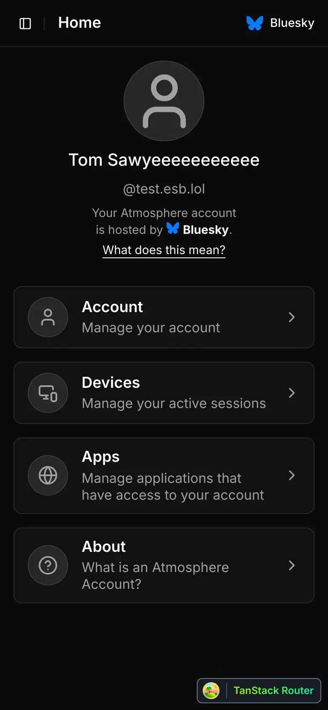<br><sub>Home</sub></td>
    <td align="center"><br><sub>Settings</sub></td>
    <td align="center">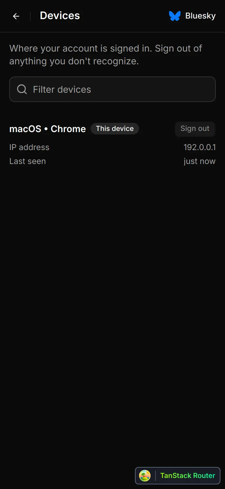<br><sub>Devices</sub></td>
  </tr>
  <tr>
    <td align="center">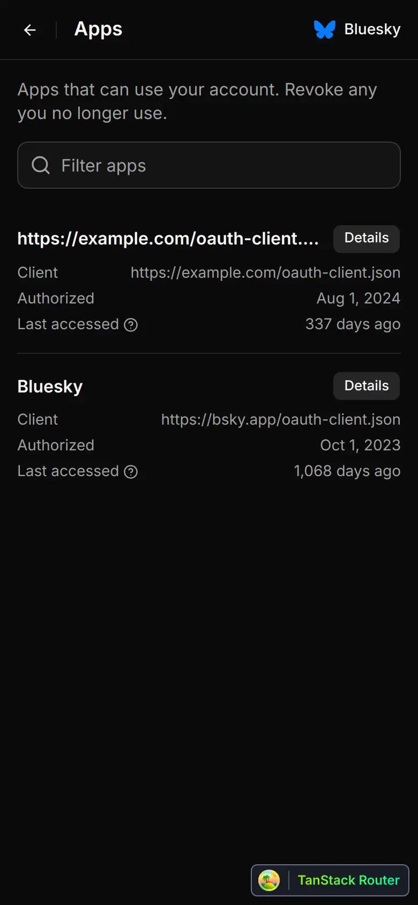<br><sub>Apps</sub></td>
  </tr>
</table>

On desktop the same pages sit beside a sidebar, at 1280×800:


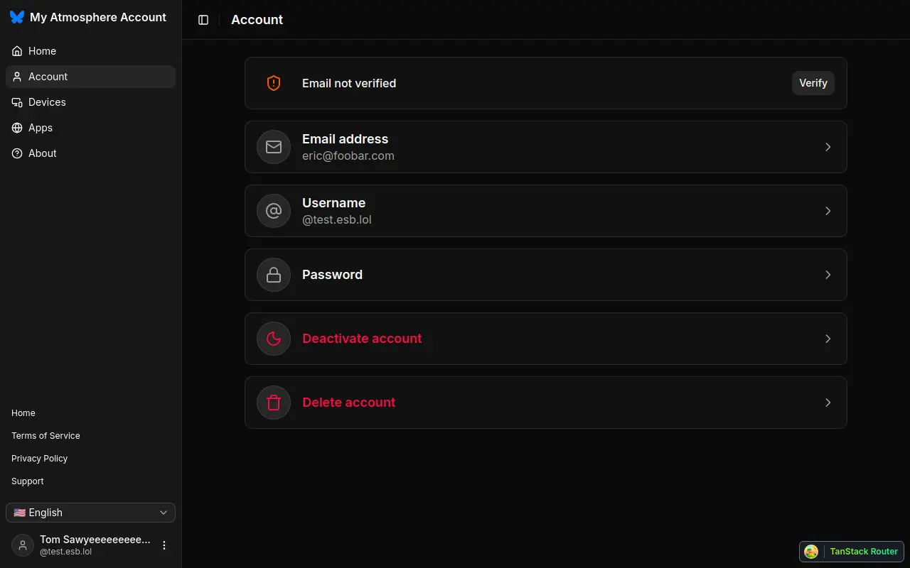
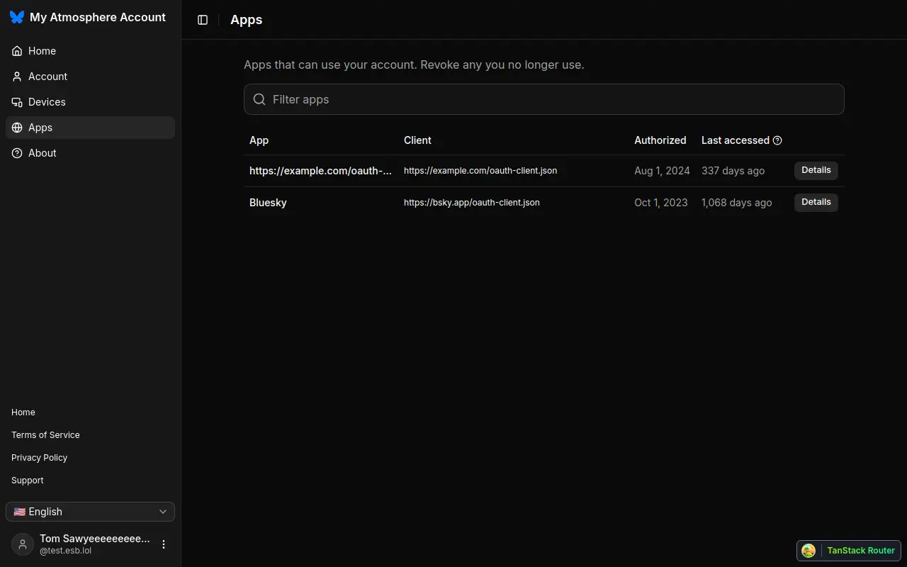

## Running the mock

```sh
pnpm install
pnpm run i18n:compile   # once, or after changing any string
pnpm dev:ui             # http://localhost:5174
```

Then open:

- `/authorization-page.html` — the OAuth flow: picker, sign-in, 2FA,
  password reset, sign-up, consent, redirect.
- `/account-page.html` — the account manager, every path under `/account`.
- `/error-page.html` and `/cookie-error-page.html`.

Everything runs against `src/mock-api.ts`; no PDS, no Docker. Sign in as any
listed account with any password. `matthieu.bsky.social` asks for a 2FA code
(`AAAAA-AAAAA`), `alice.test` is deactivated.

## Checking a change

```sh
pnpm exec tsc --build tsconfig.json
pnpm test
pnpm run i18n          # then check the msgid diff and fill every locale
```

Run eslint from the repository root, not from this package.
